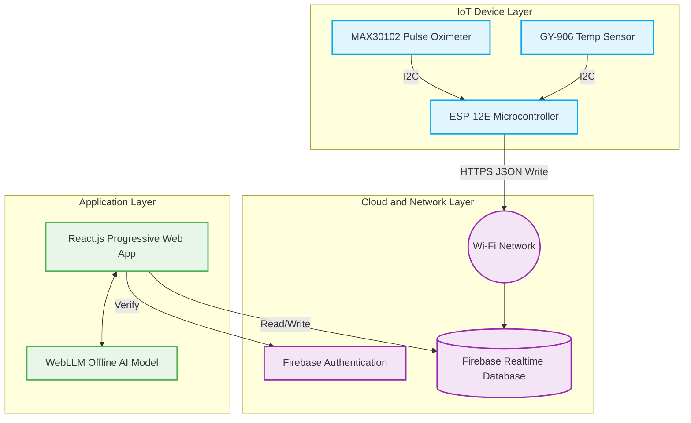
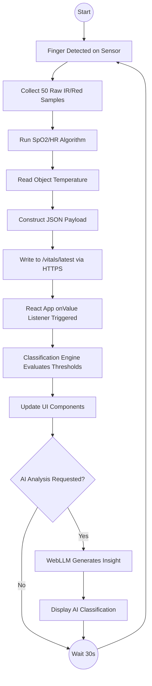
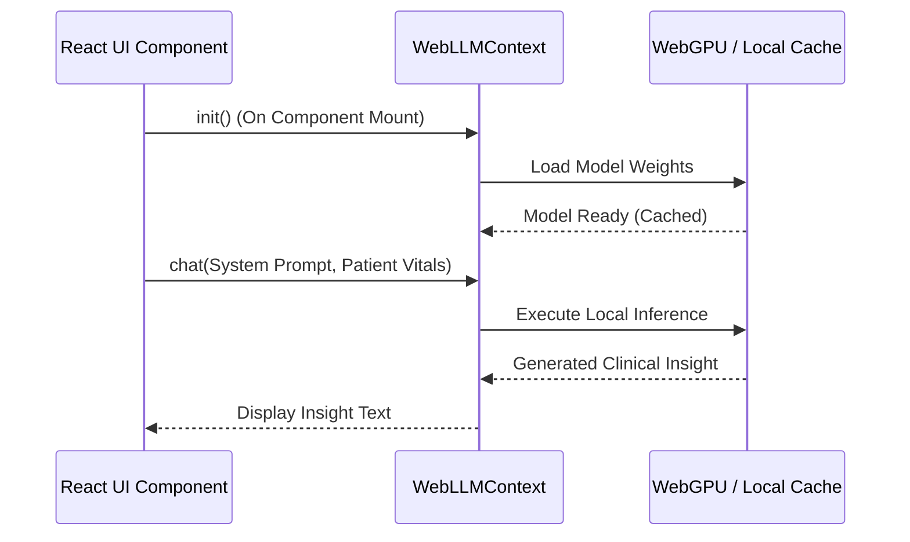
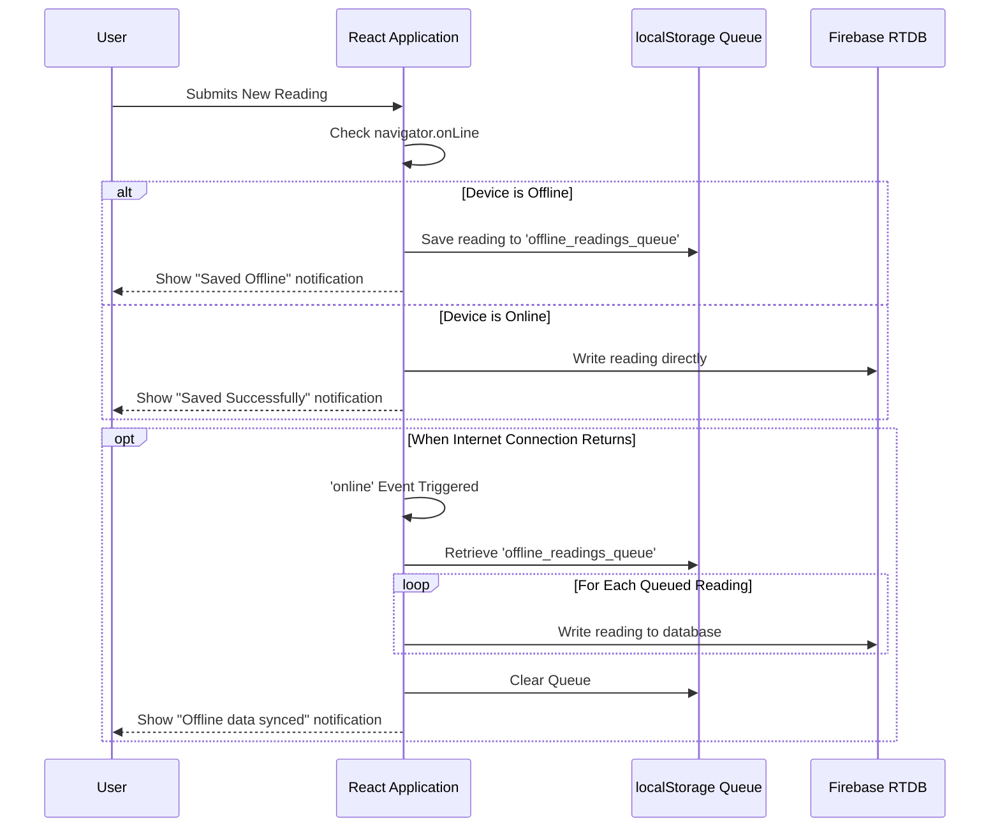
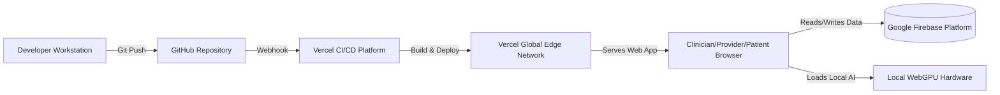

# CHAPTER FOUR
# SYSTEM DESIGN

## 4.1 Introduction
This chapter presents the detailed system design for the MediMonitor remote patient monitoring system. It translates the methodologies discussed in Chapter Three into concrete architectural models, schematics, and data structures. The chapter covers the overall system architecture, hardware connections, data flow pathways, and the structure of the Firebase Realtime Database. It also details the logical design of the classification engine, the privacy-preserving AI subsystem, the role-based user interface, and the offline synchronization mechanism. Through diagrams and descriptive text, this chapter provides a complete blueprint of how the system's components interact to fulfill the project's objectives.

## 4.2 System Architecture Diagram
The MediMonitor system follows a three-tier architecture comprising the IoT Device Layer, the Cloud and Network Layer, and the Application Layer. This separation of concerns ensures modularity and scalability.

At the IoT Device Layer, sensors capture physiological data and pass it over the I2C bus to the ESP-12E microcontroller. The microcontroller processes this data and pushes it to the Cloud Layer via Wi-Fi. The Cloud Layer, powered by Firebase, manages authentication and provides real-time data synchronization. Finally, the Application Layer serves the user interface to clinicians, providers, and patients, fetching real-time data from Firebase and executing AI inferences locally through WebLLM.

## 4.3 Hardware Schematic Design
The hardware design focuses on simplicity, reliability, and cost-effectiveness. The central component is the ESP-12E microcontroller (mounted on a NodeMCU 1.0 development board), which interfaces with two sensors over a single Inter-Integrated Circuit (I2C) bus.

The MAX30102 pulse oximeter module and the GY-906 (MLX90614) infrared thermometer module both communicate via I2C. The ESP-12E uses its default I2C pins: D1 (GPIO 5) for the Serial Clock Line (SCL) and D2 (GPIO 4) for the Serial Data Line (SDA). Both sensors require a 3.3V power supply, which is provided directly by the 3.3V output pin on the NodeMCU board. The NodeMCU board itself is powered via its micro-USB port using a standard 5V USB power adapter or power bank.

The hardware connections are detailed in Table 4.1 below.

**Table 4.1: Hardware Pin Connections**

| Component | Component Pin | ESP-12E (NodeMCU) Pin | Description |
| :--- | :--- | :--- | :--- |
| **MAX30102** | VIN | 3V3 | Power Supply (3.3V) |
| | GND | GND | Common Ground |
| | SCL | D1 (GPIO 5) | I2C Clock |
| | SDA | D2 (GPIO 4) | I2C Data |
| | INT | Not Connected | Interrupt (Polling used instead) |
| **GY-906** | VIN | 3V3 | Power Supply (3.3V) |
| | GND | GND | Common Ground |
| | SCL | D1 (GPIO 5) | I2C Clock |
| | SDA | D2 (GPIO 4) | I2C Data |

Because the MAX30102 operates at I2C address 0x57 and the GY-906 operates at 0x5A, they can share the same SDA and SCL lines without data collision. No external pull-up resistors are required because both sensor breakout boards include internal pull-up resistors on the I2C lines.

## 4.4 Data Flow Design
Data flows through the system in a continuous pipeline from physical capture at the patient's fingertip to clinical classification on the dashboard.

The process begins when the ESP-12E detects a finger on the MAX30102 sensor (registered when the raw infrared value exceeds 50,000). The microcontroller collects 50 consecutive samples of red and infrared light absorption. It processes these buffers using the maxim_heart_rate_and_oxygen_saturation algorithm to extract accurate blood oxygen saturation and heart rate values. Concurrently, it reads the patient's body temperature from the GY-906 sensor. 

The microcontroller constructs a JSON object containing these three vitals along with a timestamp, and overwrites the node at `/vitals/latest` in the Firebase Realtime Database. On the frontend, a listener hook (`useVitalsListener`) detects this database change instantly. The incoming reading is passed through the classification engine, which determines its severity (Normal, Warning, or Critical) based on the patient's configured thresholds. The user interface updates immediately to reflect the new reading and its associated status badge.

## 4.5 Database Design
The system uses Firebase Realtime Database, a NoSQL, JSON-based cloud database. Data is organized into logical nodes rather than relational tables. This structure supports fast, real-time synchronization and allows for flexible data schemas. The database is divided into five primary top-level nodes: `vitals`, `readings`, `users`, `alerts`, and `notes`.

### 4.5.1 Vitals Node
The `/vitals/latest` node acts as a temporary buffer for the hardware. The ESP-12E continuously overwrites this node with the most recent sensor reading. The web application listens to this node during a reading capture session.

| Field | Type | Description |
| :--- | :--- | :--- |
| heartRate | Integer | Heart rate in beats per minute (bpm). |
| spo2 | Integer | Blood oxygen saturation percentage. |
| temperature | Float | Body temperature in degrees Celsius. |
| timestamp | Integer | Epoch timestamp of the capture. |

### 4.5.2 Users Node
The `/users/{uid}` node stores profile information for all users in the system, mapped to their Firebase Authentication unique identifier (UID).

| Field | Type | Description |
| :--- | :--- | :--- |
| name | String | Full name of the user. |
| email | String | Email address used for authentication. |
| role | String | System role: 'patient', 'clinician', or 'provider'. |
| memberId | String | Unique hospital membership identifier (e.g., VX-001). |
| condition | String | Primary medical condition (for patients). |
| height | Number | Patient height in centimetres. |
| weight | Number | Patient weight in kilograms. |

### 4.5.3 Readings Node
The `/readings/{patientId}/{pushId}` node permanently archives all captured readings for a specific patient. It is structured to support time-series charting and historical analysis.

| Field | Type | Description |
| :--- | :--- | :--- |
| spo2 | Integer | Oxygen saturation level. |
| heartRate | Integer | Heart rate in bpm. |
| temperature | Float | Body temperature. |
| status | String | Calculated severity: 'NORMAL', 'WARNING', or 'CRITICAL'. |
| bmi | String | Body Mass Index at the time of reading. |
| capturedBy | String | UID of the provider or patient who recorded the data. |
| timestamp | Integer | Epoch timestamp of the reading. |

### 4.5.4 Alerts Node
The `/alerts/{alertId}` node records instances where a patient's vital signs crossed a critical threshold, triggering an emergency notification.

| Field | Type | Description |
| :--- | :--- | :--- |
| patientId | String | UID of the patient experiencing the event. |
| severity | String | Alert level ('CRITICAL' or 'WARNING'). |
| message | String | Automated description of the triggering condition. |
| gpsCoordinates | Object | Contains 'lat' and 'lng' values if captured during home monitoring. |
| status | String | Lifecycle state: 'unresolved' or 'resolved'. |

### 4.5.5 Notes Node
The `/notes/{patientId}/{pushId}` node stores clinical session notes authored by clinicians. 

| Field | Type | Description |
| :--- | :--- | :--- |
| content | String | The text content of the clinician's observation. |
| tags | Array | Categorical tags (e.g., 'Follow-up', 'Medication Review'). |
| authorId | String | UID of the clinician who authored the note. |
| timestamp | Integer | Epoch timestamp of the note creation. |

## 4.6 Authentication and Access Control Design
MediMonitor employs a robust role-based access control (RBAC) mechanism integrated with Firebase Authentication. When a user logs in via the `LoginPage`, Firebase verifies their email and password. Upon successful authentication, the system retrieves the user's profile from the `/users/{uid}` database node to determine their assigned role.

The application routing is protected by a custom `ProtectedRoute` component. This component acts as a gatekeeper. If an unauthenticated user attempts to access any route other than the login page, they are redirected to `/login`. If an authenticated user attempts to access a route reserved for a different role, they are redirected to their designated dashboard.

The access control matrix is defined as follows:
* **Clinicians** have access to the `/clinician/*` routes, providing them with a comprehensive view of all assigned patients, alert management, and threshold configuration tools.
* **Healthcare Providers** have access to the `/provider/*` routes, focusing on the in-clinic workflow of identifying patients, recording BMI, and capturing spot readings.
* **Patients** have access to the `/patient/*` routes, which are restricted to viewing their own historical data and capturing self-monitoring readings at home.

## 4.7 Classification Engine Design
The classification engine evaluates incoming vital signs to determine the patient's current health status. This status drives the colour coding of the user interface (green, amber, red) and triggers the alert system. The engine applies a deterministic, rule-based algorithm implemented in the `classifyReading` function.

The logic evaluates three parameters: blood oxygen saturation (SpO2), heart rate (HR), and temperature. The engine uses a worst-case evaluation strategy. If any single parameter falls into the Critical range, the entire reading is classified as Critical, irrespective of the other values. If no parameter is Critical but at least one falls into the Warning range, the reading is classified as Warning. If all parameters fall within acceptable bounds, the reading is classified as Normal.

The default decision boundaries are detailed in Table 4.2.

**Table 4.2: Vital Sign Classification Decision Boundaries**

| Parameter | Critical | Warning | Normal |
| :--- | :--- | :--- | :--- |
| **SpO2 (%)** | < 90 | 90 to 93 | ≥ 94 |
| **Heart Rate (bpm)** | < 40 OR > 120 | 40-59 OR 101-120 | 60 to 100 |
| **Temperature (°C)** | ≤ 35.0 OR ≥ 39.5 | 35.1-35.9 OR 38.0-39.4 | 36.0 to 37.9 |

A critical design feature of MediMonitor is that these default thresholds can be customized. Clinicians can adjust the Normal, Warning, and Critical boundaries for individual patients to account for chronic conditions (such as setting a lower SpO2 warning threshold for a patient with COPD). When custom thresholds are saved to a patient's profile in the database, the `classifyReading` function evaluates that specific patient's data against their personalized boundaries rather than the global defaults.

## 4.8 AI Subsystem Design
To provide advanced clinical decision support without compromising patient data privacy, MediMonitor integrates an offline Artificial Intelligence subsystem using the WebLLM framework.

### 4.8.1 Architecture and Model Selection
The AI subsystem relies on the WebGPU API to execute neural network computations directly on the user's local graphics hardware. The chosen model is SmolLM2-135M-Instruct-q0f32-MLC. This 135-million parameter language model offers an optimal balance between reasoning capability and computational efficiency, allowing it to load quickly and run smoothly within a web browser on standard hardware.

Because all inference happens locally within the browser, sensitive medical data such as patient names, SpO2 levels, and session notes are never transmitted to external cloud providers. This architecture guarantees total data privacy.

### 4.8.2 AI Integration Points
The AI subsystem is exposed to the application through the `WebLLMContext` and is utilized in four key areas:
1. **Clinician AI Assistant:** A persistent sidebar on the patient detail page that generates an instant 10-second patient briefing based on recent vital trends and allows the clinician to ask follow-up questions.
2. **AI Triage of Alerts:** On the alerts dashboard, clinicians can click a triage button to have the AI analyze the specific vital signs that triggered an alert and recommend immediate actions.
3. **Session Note Enhancement:** Clinicians writing shorthand notes can invoke the AI to expand their observations into professionally formatted clinical documentation.
4. **AI Clinical Classification:** During the Provider capture workflow, the AI analyses the freshly captured SpO2, heart rate, and temperature to provide a nuanced "mild classification" (e.g., identifying mild hypoxia or moderate tachycardia) and a concise recommendation, adding context beyond the rigid rule-based classification engine.

## 4.9 Alert System Design
The alert system is designed to notify stakeholders when a patient's condition deteriorates. The system differentiates between Warning-level events, which require observation, and Critical-level events, which demand immediate intervention.

When a reading is classified as Warning, the system generates an in-app notification. This alert is logged in the `/alerts` database node and appears on the clinician's dashboard, but it does not trigger external communications, thereby reducing alert fatigue.

When a reading is classified as Critical, the system escalates the response. In addition to the in-app logging, the application interfaces with the Hubtel SMS API. The system formats a high-priority text message containing the patient's name, their critical vital signs, and an urgent call to action. For patients capturing readings at home via the Patient Dashboard, the application leverages the browser's Geolocation API to capture the user's current latitude and longitude. These GPS coordinates are appended to the SMS message, ensuring that emergency responders or clinicians know exactly where the patient is located.

Alerts possess a lifecycle state. They are created as 'unresolved' and remain highlighted on the clinical dashboards until a clinician reviews the patient's data, takes appropriate action, and manually marks the alert as 'resolved'.

## 4.10 User Interface Design
The user interface is designed using React.js and styled with tailored CSS to provide a modern, clinical-grade aesthetic. The interface heavily utilises "true dark mode" styling, which is specifically designed to reduce eye strain in low-light hospital environments and improve data contrast on mobile devices.

### 4.10.1 Clinician Dashboard
The Clinician interface provides a macro-level view of all assigned patients. The central dashboard features a statistical summary of active alerts and recent readings. A prominent component is the recent patients table, which incorporates `SparklineChart` components to visually represent the 24-hour trend of each patient's vital signs in a highly condensed format. The `PatientDetail` view offers deep analytical tools, including a comprehensive historical reading table, trend graphs built with Recharts, a session notes input area with AI enhancement, and a configuration panel for setting personalised thresholds.

### 4.10.2 Provider Capture Workflow
The Healthcare Provider interface is streamlined for speed and accuracy in a clinical setting. The core feature is the `CaptureReading` component, which implements a four-step wizard:
1. **Identify Patient:** The provider selects a patient from the database or registers a new walk-in patient.
2. **BMI Entry:** The provider optionally inputs the patient's height and weight, allowing the system to calculate and store the Body Mass Index (BMI).
3. **Capture Reading:** The provider places the patient's finger on the IoT device. The interface listens to the `/vitals/latest` Firebase node and displays real-time data as it arrives. Alternatively, the provider can manually enter readings from legacy equipment.
4. **Result:** The system displays the final captured values alongside the rule-based status badge (e.g., NORMAL). In this step, the provider can also invoke the AI Clinical Classification tool to receive an instant, AI-generated clinical assessment of the vitals.

### 4.10.3 Patient Self-Monitoring View
The Patient interface is simplified to avoid overwhelming the user with clinical terminology. The dashboard prominently displays the user's latest SpO2, heart rate, and temperature readings using large, highly legible typography and colour-coded `StatusBadge` components. A historical chart allows the patient to track their progress over time. The capture reading screen provides clear, step-by-step instructions for interacting with the IoT hardware at home.

## 4.11 Offline Architecture Design
To address the challenge of intermittent internet connectivity in rural and peri-urban areas, MediMonitor is designed as a Progressive Web Application (PWA) with robust offline capabilities.

The system uses a Service Worker to cache the application shell (HTML, CSS, JavaScript), allowing the web app to load even without a network connection. When a user captures a reading, the `saveReading` function checks the browser's `navigator.onLine` status. If the device is offline, the reading is serialized and pushed to an array stored in the browser's `localStorage`. 

The main application component (`App.jsx`) registers an event listener for the browser's native `online` event. When the device regains connectivity, this event fires, triggering the `syncOfflineReadings` function. This function iterates through the `localStorage` queue, transmits all stored readings to the Firebase database, and then clears the local queue. This architecture ensures no clinical data is lost due to transient network failures.

## 4.12 Deployment Architecture
The deployment architecture is designed for continuous integration, high availability, and zero-maintenance infrastructure.

The source code for the React frontend is hosted in a GitHub repository. Vercel, a cloud platform optimized for frontend frameworks, is linked to this repository. Whenever new code is pushed to the master branch, Vercel automatically detects the changes, executes the build process, and deploys the updated application to its global content delivery network (CDN). 

The backend infrastructure is entirely hosted by Google's Firebase platform, which provides the Realtime Database and Authentication services. This serverless deployment strategy removes the need for manual server provisioning, load balancing, or database maintenance, allowing the system to scale automatically with user demand.

## 4.13 Chapter Summary
This chapter has provided a comprehensive examination of the MediMonitor system design. The architecture was detailed across three tiers: the IoT Device Layer, the Cloud Layer, and the Application Layer. The hardware schematics defined the I2C interactions between the ESP-12E microcontroller, the MAX30102 pulse oximeter, and the GY-906 temperature sensor. The software design mapped out the continuous data flow from physical sensor capture to the Firebase Realtime Database and into the React.js web application. 

The chapter also outlined the structure of the NoSQL database, the role-based access control routing, and the logic underpinning the vital sign classification engine. A significant focus was placed on the privacy-preserving AI subsystem, which uses WebLLM to deliver on-device clinical insights without exposing sensitive data. Finally, the chapter described the user interface workflows for clinicians, providers, and patients, the Progressive Web App offline synchronization architecture, and the automated Vercel deployment pipeline. These design specifications form the blueprint for the system implementation detailed in the following chapter.
